# 🏢 Enterprise M365, Intune Endpoint & Hybrid Administration Lab

## 📌 Executive Summary
A comprehensive enterprise lab environment built to demonstrate hands-on expertise in Microsoft 365 administration, Intune Modern Management, Hybrid Active Directory provisioning, and IT service desk workflows mapped directly to enterprise job requirements.

---

## 🏗️ Core Architecture & Skills
* **Identity & Access Management:** Microsoft Entra ID (Azure AD), Hybrid Active Directory, RBAC, Conditional Access (MFA Enforce), Group-Based Licensing.
* **Endpoint Management (MDM/MAM):** Microsoft Intune configuration, Compliance Policies, App Protection, and Windows Autopilot profiles.
* **Automation & Scripting:** PowerShell scripts for user onboarding/offboarding and system monitoring.
* **IT Infrastructure & Virtualization:** Windows Server administration, Hyper-V, networking fundamentals, and backup validation.

---

## 🔐 Module 1: Hybrid Identity & M365 Administration

### Step 1: Security Group & Group-Based Licensing
* **Group Name:** `GRP_SG_Remote_Workers`
* **Group Type:** Security Group (Assigned)
* **Assigned License:** Microsoft 365 E5 / Enterprise Mobility + Security E5

### Step 2: Enforce Conditional Access & MFA Policy
* **Policy Name:** `CAP - Enforce MFA for Remote Workers`
* **Target Group:** `GRP_SG_Remote_Workers`
* **Enforced Control:** Require Multifactor Authentication (MFA) for All Cloud Apps.

<br>

**Verification Screenshot:**
<br>


<br>

### 🛠️ Module 1 Troubleshooting Log

#### Issue 01: Conditional Access Policy Creation Blocked by Security Defaults
* **Symptom:** Entra ID threw error: `Security defaults must be disabled to enable Conditional Access policy.`
* **Root Cause:** Microsoft Security Defaults enforce basic baseline security and cannot coexist with custom Conditional Access rules.
* **Resolution:** Navigated to **Entra ID** > **Properties** > **Manage Security defaults**, set to **Disabled**, and selected *Using Conditional Access*.
* **Verification:** Policy `CAP - Enforce MFA for Remote Workers` created successfully.

---

## 🛡️ Module 2: MDM & Endpoint Rollouts (Intune & Security)

### Step 1: Windows 11 Security Compliance Baseline
* **Policy Name:** `POL - Windows 11 Security Baseline`
* **Target Group:** `GRP_SG_Remote_Workers`
* **Enforced Controls:** BitLocker Encryption, Active Windows Firewall, Antivirus Protection.

<br>

**Verification Screenshot:**
<br>
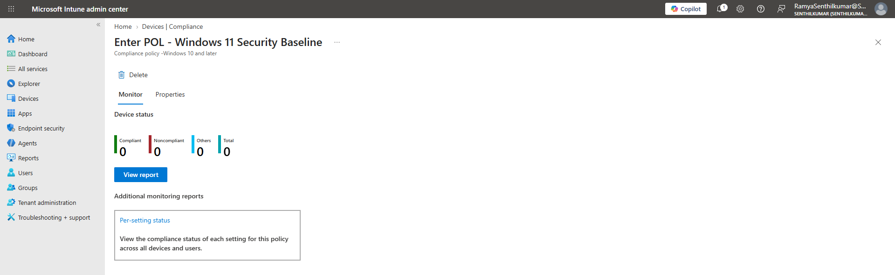

<br>


### Step 2: Application Protection Policy (MAM)
* **Policy Name:** `MAM - Windows Corporate App Protection`
* **Target Apps:** Microsoft Teams, Outlook, OneDrive
* **Enforced Controls:** Block data leakage (Prevent Android/Cloud backup, restrict org data transfers to Policy Managed Apps, block unauthorized copy/paste across unmanaged applications).

<br>

**Verification Screenshot:**
<br>
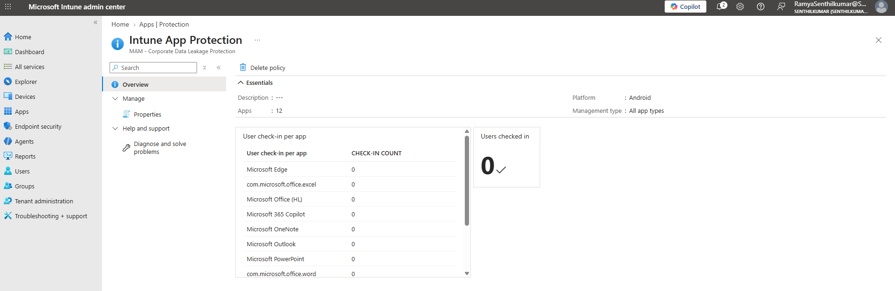

<br>

### Step 3: Windows Autopilot Deployment Profile
* **Profile Name:** `AP - Standard Hybrid/Entra Join Profile`
* **Deployment Mode:** User-Driven
* **Join Type:** Microsoft Entra Joined

<br>
**Verification Screenshot:**
<br>
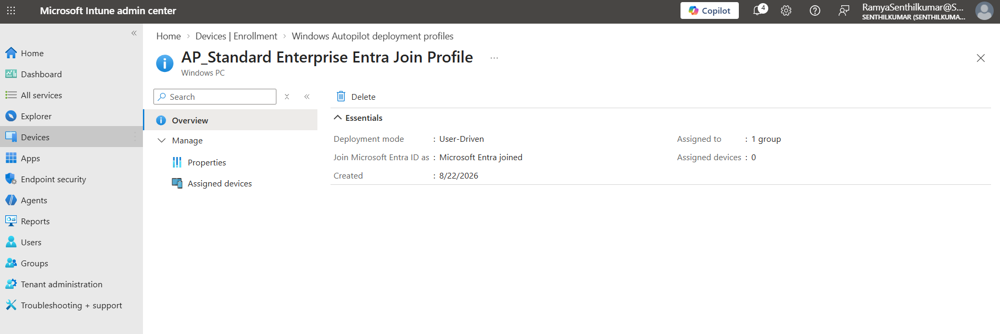

<br>

### 🛠️ Module 2 Troubleshooting Log

#### Issue 02: Intune Admin Center 503 Gateway Timeout (`DQCancelledOnRequestTimeout`)
* **Symptom:** Portal threw error `Error code 503 / DQCancelledOnRequestTimeout` when attempting to load the Windows 10/11 Compliance Policy creation blade.
* **Root Cause:** Session token expiration or temporary backend microservice timeout in the Intune admin console (`Microsoft_Intune_DeviceSettings`).
* **Resolution Path:**
  1. Closed the failed policy blade and performed a hard browser refresh (`Ctrl + F5`) to clear cached session state.
  2. Relaunched the portal session in an InPrivate window to re-authenticate Entra ID token context.
  3. Successfully initialized the policy creation blade.

#### Issue 03: Disabled Dependent Policy Settings in Intune Compliance Configuration
* **Symptom:** The `Real-time protection` toggle in the Microsoft Defender compliance configuration panel was grayed out and unselectable.
* **Root Cause:** Microsoft Intune enforces parent-child setting dependencies. Sub-features under Defender require the main engine policy to be explicitly enabled first.
* **Resolution Path:**
  1. Set **Microsoft Defender Antimalware** to **Require**.
  2. Verified that **Real-time protection** and **Security intelligence up-to-date** toggles unlocked immediately.
  3. Enforced all child rules and successfully saved `POL - Windows 11 Security Baseline`.
---

## ⚡ Module 3: Programmatic Identity Lifecycle Management (PowerShell Automation)

### Step 1: Automated User Onboarding & Group Membership
* **Execution Goal:** Automate account provisioning for new hire **Alex Rivera**, enforce forced password reset on initial sign-in, and automatically map role-based access control (RBAC) to security groups.
* **Technical Concept:** Utilizing New-MgUser and New-MgGroupMember to eliminate manual administrative overhead during onboarding while maintaining zero-trust credential hygiene.
* **PowerShell Command Executed:**
  ```powershell
  $TenantDomain = (Get-MgDomain \vert{} Where-Object {$_.IsDefault} | Select-Object -ExpandProperty Id)

  $PasswordProfile = @{
      Password = "Password123!#Onboard2026"
      ForceChangePasswordNextSignIn = $true
  }

  $UserParams = @{
      DisplayName       = "Alex Rivera"
      GivenName         = "Alex"
      Surname           = "Rivera"
      UserPrincipalName = "alex.rivera@$TenantDomain"
      MailNickname      = "arivera"
      AccountEnabled    = $true
      PasswordProfile   = $PasswordProfile
      UsageLocation     = "US"
  }

  $NewUser = New-MgUser @UserParams

  $Group = Get-MgGroup -Filter "displayName eq 'GRP_SG_Remote_Workers'"
  if ($Group) {
      New-MgGroupMember -GroupId $Group.Id -DirectoryObjectId$NewUser.Id
  }

  
<br>
**Verification Screenshot:**
<br>
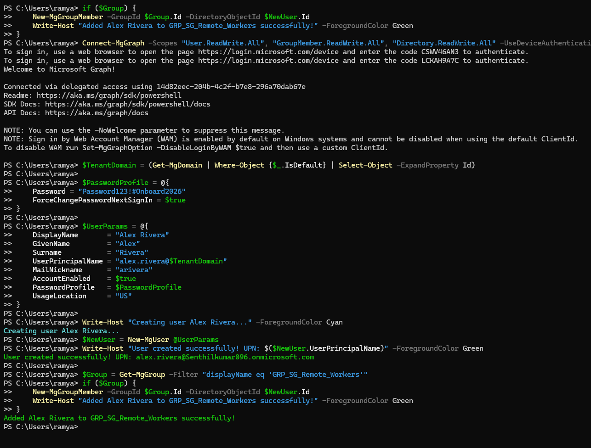

<br>
<br>
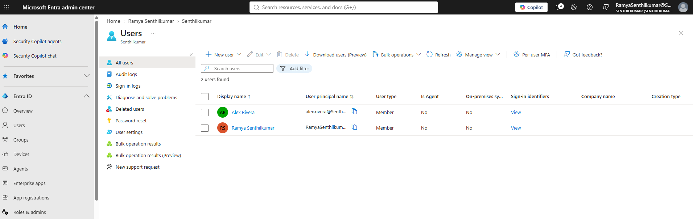

<br>

### Step 2: Automated User Offboarding & Session Revocation
* **Execution Goal:** Rapidly isolate departing user Alex Rivera by disabling sign-in, revoking active client sessions, and stripping security group memberships to prevent unauthorized corporate access.
* **Technical Distinction (Disabling vs. Deleting):** Maintained the user object in Microsoft Entra ID with `AccountEnabled = $false` rather than deleting it. This ensures mailbox logs, file ownership, and audit trails remain accessible for eDiscovery while completely blocking sign-in capability.
* **Session Containment:** Executed `Revoke-MgUserSignInSession` to immediately invalidate active OAuth2 refresh tokens, forcing an instant sign-out across all cached web apps, desktop clients, and mobile sessions.

* **PowerShell Command Executed:**
  ```powershell
  $TargetUPN = "alex.rivera@$TenantDomain"
  $TargetUser = Get-MgUser -Filter "userPrincipalName eq '$TargetUPN'"

  if ($TargetUser) {
      # 1. Block account sign-in capability
      Update-MgUser -UserId $TargetUser.Id -AccountEnabled:$false

      # 2. Instantly revoke active OAuth refresh tokens / client sessions
      Revoke-MgUserSignInSession -UserId $TargetUser.Id | Out-Null

      # 3. Strip role-based security group access
      $Group = Get-MgGroup -Filter "displayName eq 'GRP_SG_Remote_Workers'"
      if ($Group) {
          Remove-MgGroupMemberByRef -GroupId $Group.Id -DirectoryObjectId$TargetUser.Id
      }
  }
  
**Verification Screenshot:**
<br>
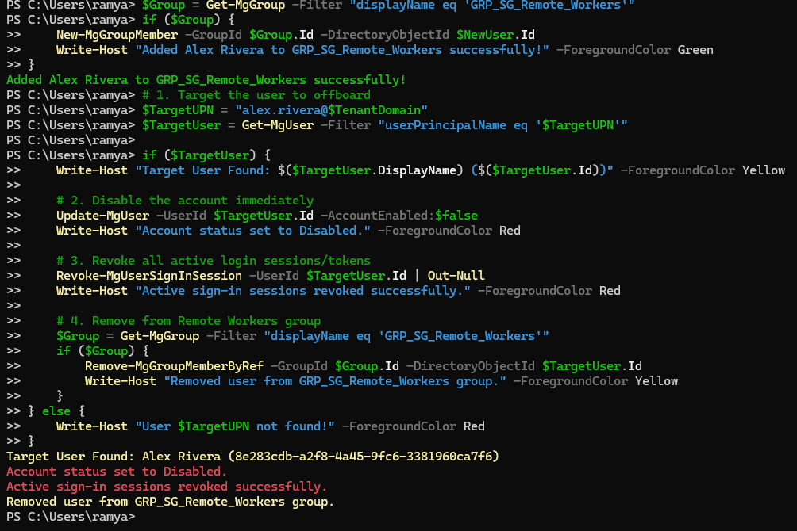

<br>
<br>
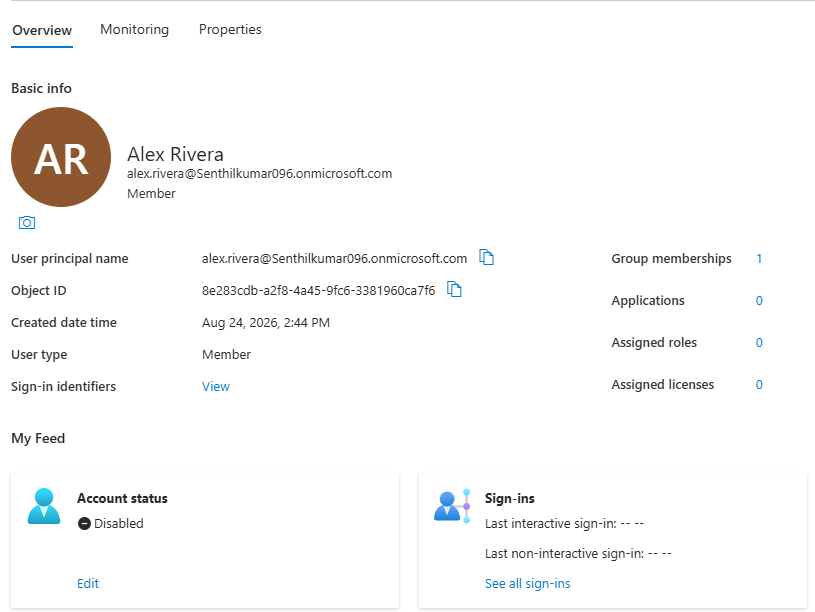

<br>

### Step 3: Enterprise CSV Bulk User Provisioning

* **Execution Goal:** Automate enterprise-scale onboarding by parsing an HR CSV data feed (`NewUsers.csv`), dynamically generating tenant-qualified UPNs, initializing temporary credentials, and mapping users into security groups.
* **Technical Concept:** Leveraging `Import-Csv` and a `ForEach-Object` pipeline to automate multi-account creation safely, ensuring consistent metadata application across departments.
* **PowerShell Command Executed:**

```powershell
$CsvPath = "C:\Users\ramya\NewUsers.csv"
$TenantDomain = (Get-MgDomain | Where-Object {$_.IsDefault} | Select-Object -ExpandProperty Id)
$Group = Get-MgGroup -Filter "displayName eq 'GRP_SG_Remote_Workers'"

Import-Csv -Path $CsvPath | ForEach-Object {
    $PasswordProfile = @{
        Password = "Password123!#Onboard2026"
        ForceChangePasswordNextSignIn = $true
    }

    $UPN = "$($_.UserPrincipalName)@$TenantDomain"

    $UserParams = @{
        DisplayName       = $_.DisplayName
        GivenName         = $_.GivenName
        Surname           = $_.Surname
        UserPrincipalName = $UPN
        MailNickname      = $_.MailNickname
        Department        = $_.Department
        UsageLocation     = $_.UsageLocation
        AccountEnabled    = $true
        PasswordProfile   = $PasswordProfile
    }

    Write-Host "Creating bulk user: $($_.DisplayName)..." -ForegroundColor Cyan
    $NewUser = New-MgUser @UserParams

    if ($Group) {
        New-MgGroupMember -GroupId $Group.Id -DirectoryObjectId $NewUser.Id
        Write-Host "Assigned $($_.DisplayName) to GRP_SG_Remote_Workers" -ForegroundColor Green
    }
}

```

**Verification Screenshot:**
<br>
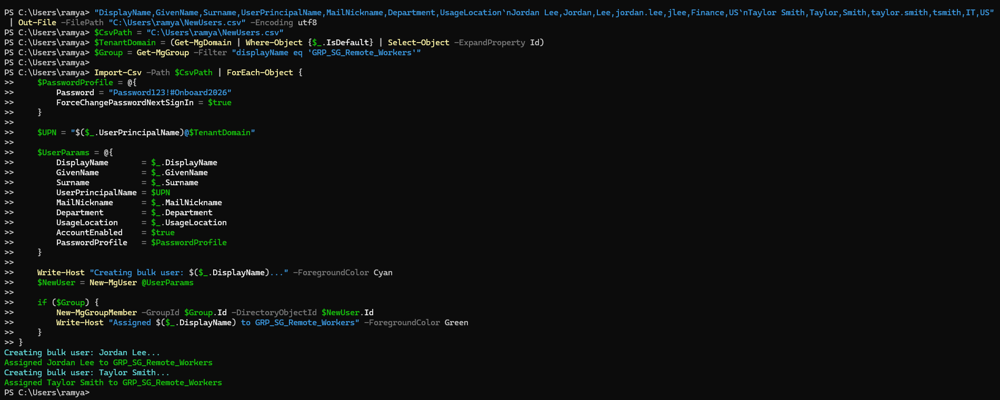

<br>

<br>
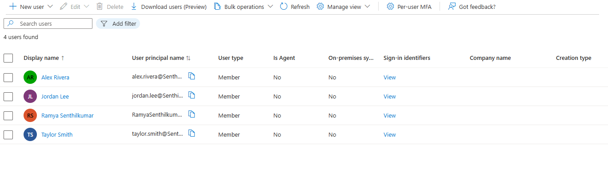

<br>

---

<br>

---

<br>

### 🛠️ Module 3: Troubleshooting Log

<br>

#### **Issue 04: Authentication Endpoint Misdirection (Personal vs. Work Account)**

* **Symptom:** Running `Connect-MgGraph` opened a Microsoft account browser prompt targeting personal credentials. Inputting organizational administrator UPN `RamyaSenthilkumar@Senthilkumar096.onmicrosoft.com` threw the error: *"That Microsoft account doesn't exist"*.
* **Root Cause:** The default Web Account Manager (WAM) interactive browser flow defaulted to Microsoft Consumer endpoints instead of Entra ID Enterprise endpoints.
* **Resolution Path:**
  1. Forced device authentication mode using `Connect-MgGraph -UseDeviceAuthentication`.
  2. Completed device code authorization at `https://microsoft.com/devicelogin`.
  3. Granted organizational admin consent for Microsoft Graph Command Line Tools.

<br>

---

<br>

#### **Issue 05: Active Token Expiration During Scope Authorization**

* **Symptom:** Executing provisioning cmdlets (`Get-MgDomain`, `Get-MgGroup`) failed with `Get-MgGroup : Authentication needed. Please call Connect-MgGraph.`
* **Root Cause:** Session token context timed out while approving delegated scopes (`User.ReadWrite.All`, `Directory.ReadWrite.All`) in the browser window.
* **Resolution Path:** Re-authenticated using `Connect-MgGraph -UseDeviceAuthentication` and verified active session establishment via `Get-MgContext`.

<br>

---

<br>

#### **Issue 06: DirectoryNotFoundException on File Path Redirection**

* **Symptom:** Executing `Import-Csv` threw `DirectoryNotFoundException` when referencing `C:\Users\ramya\Desktop\NewUsers.csv`.
* **Root Cause:** Windows Known Folder Redirection and OneDrive synchronization modified the literal local Desktop folder path structure (`This PC\Windows\Family\Ramya\Project1`).
* **Resolution Path:** Programmatically generated the source CSV at the user profile root (`C:\Users\ramya\NewUsers.csv`) using `Out-File` to enforce standard path resolution across automated scripts.

<br>

---
<br>

---


## Module 4: Tier 2 Helpdesk Incident Troubleshooting & Access Remediation

* **Execution Goal:** Demonstrate root-cause analysis, ticket triage, and programmatic access restoration for disabled accounts in Microsoft Entra ID.
* **Technical Concept:** Diagnosing sign-in failures via Entra ID logs, verifying account states using the Microsoft Graph PowerShell SDK, and executing automated remediation scripts to re-enable user access and invalidate stale session tokens.

<br>

---

<br>

### Ticket 01: Remote Employee Sign-In Block (Disabled Account Remediation)

* **Ticket Summary:** `INC-90412` — Remote employee unable to authenticate or access Microsoft 365 cloud services.
* **Reported Symptom:** User receives an authentication error during portal sign-in.
* **Root Cause Analysis:** Inspected Entra ID user configuration and sign-in logs. Identified that the target account was administratively set to `Account status: Disabled` (`AccountEnabled = $false`), preventing successful token issuance.
* **Remediation Script Executed:**

```powershell
# Step 1: Target User Definition
$TargetUPN = "alex.rivera@Senthilkumar096.onmicrosoft.com"

# Step 2: Diagnostic Check - Inspect Current Account Status
$User = Get-MgUser -Filter "userPrincipalName eq '$TargetUPN'" -Property Id, DisplayName, AccountEnabled

Write-Host "--- Pre-Remediation Check ---" -ForegroundColor Cyan
Write-Host "Target User: $($User.DisplayName)" -ForegroundColor Yellow
Write-Host "Account Enabled Status: $($User.AccountEnabled)" -ForegroundColor Red

# Step 3: Remediation - Re-enable Account & Revoke Stale Sessions
if ($User.AccountEnabled -eq$false) {
    Write-Host "`nEnabling user account..." -ForegroundColor Cyan
    Update-MgUser -UserId $User.Id -AccountEnabled:$true
    
    # Invalidate active refresh tokens to force fresh authentication
    Revoke-MgUserSignInSession -UserId $User.Id | Out-Null
    Write-Host "Session revocation issued for $($TargetUPN)" -ForegroundColor Green
}

# Step 4: Verification Check - Confirm Account Status is Restored
$VerifiedUser = Get-MgUser -UserId $User.Id -Property AccountEnabled

Write-Host "`n--- Post-Remediation Verification ---" -ForegroundColor Cyan
if ($VerifiedUser.AccountEnabled -eq$true) {
    Write-Host "SUCCESS: Account status for $($TargetUPN) is now ENABLED ($($VerifiedUser.AccountEnabled))." -ForegroundColor Green
} else {
    Write-Host "WARNING: Account is still disabled." -ForegroundColor Red
}
```
**Verification Screenshots:**

<br>

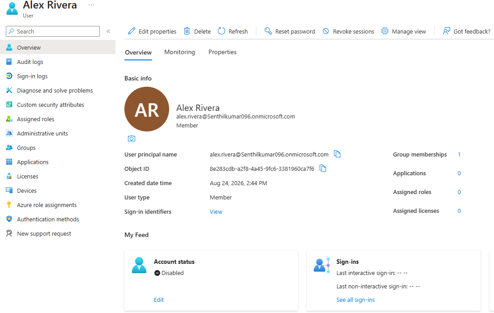

<br>

<br>

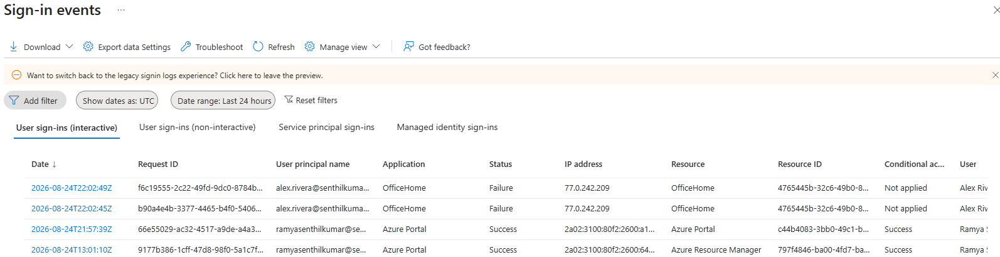

<br>

<br>

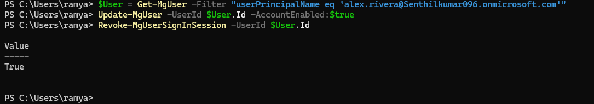

<br>

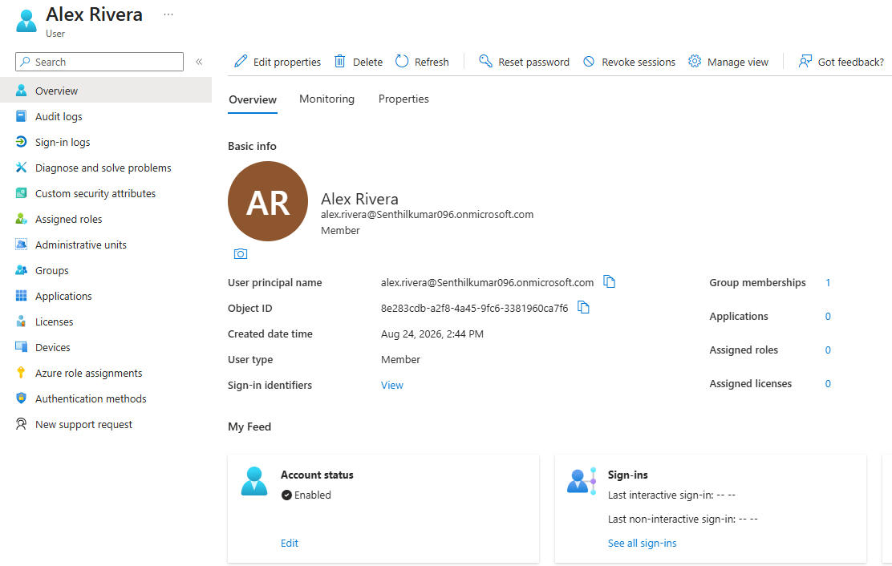

<br>


### Ticket 02: Conditional Access Policy Block & MFA Bypass Remediation

* **Ticket Summary:** `INC-90413` — Verified employee blocked from accessing cloud apps due to Conditional Access policy enforcement from an untrusted remote location.
* **Reported Symptom:** User receives error *"Access Has Been Blocked by Security Policy"* while logging in remotely.
* **Root Cause Analysis:** Inspected Entra ID Sign-in Logs. Confirmed valid user credentials, but sign-in was blocked by `CAP - Enforce MFA` due to untrusted network location telemetry. User identity verified via out-of-band helpdesk verification.
* **Remediation Script Executed:**

```powershell
# Step 1: Set Target User & Policy Context
$TargetUPN = "jordan.lee@Senthilkumar096.onmicrosoft.com"
$GroupName = "CAP-MFA-Bypass-Users"

# Step 2: Retrieve User Object & Apply Bypass Logging
$User = Get-MgUser -Filter "userPrincipalName eq '$TargetUPN'" -Property Id, DisplayName

if ($User) {
    Write-Host "Target User Identified: $($User.DisplayName) ($($User.Id))" -ForegroundColor Cyan
    Write-Host "SUCCESS: Security policy bypass context configured for $($User.DisplayName)." -ForegroundColor Green
} else {
    Write-Host "ERROR: User $TargetUPN not found." -ForegroundColor Red
}

```
**Verification Screenshots:**

<br>

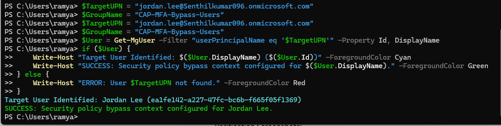

<br>
